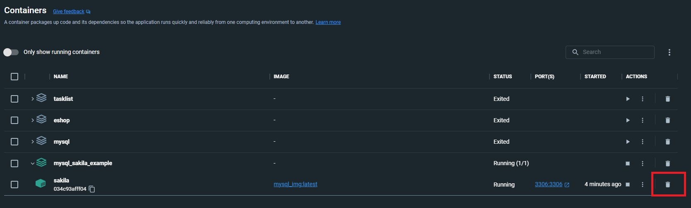
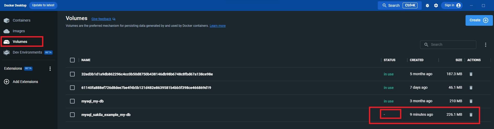

## How to

### Re-run (fresh-restart)


1. Delete docker container
    ```shell
    docker-compose rm --stop sakila
    ```
   Here's how to do that in Docker Desktop (UI):
   

2. Delete docker volume that had been related to the deleted container
   ```shell
   docker volume prune
   ```
   Here's how to do that in Docker Desktop (UI):
   

3. Build containers once again:
   ```shell
   docker-compose up --build -d
   ```

### Run (start) the containers
Run this command line in you command shell (from directory of [docker-compose](./docker-compose.yaml))
```shell
docker-compose up --build -d
```
Here:
- `docker-compose up`: start and run your services in the context defined by a docker-compose.yml file
- `--build` - build images before starting containers.\
  If an image does not exist, Docker Compose will build it using the Dockerfile specified in the docker-compose.yml file.\
  If an image already exists, and the Dockerfile has been changed, the `--build` flag ensures
  that the changes will be included by creating a new image.
- `-d` is a short for `--detach`, which makes Docker Compose start the containers in the background\
  and leave them running without logging to the console

### Stop running containers
```shell
docker-compose stop
```

### Remove containers
```shell
docker-compose rm <container name>
```
- `rm` - remove
- `<container name>` container name (in our case - `sakila`)

### Remove volumes
MySQL (basically any non-runtime DB) saves its data in a volume.
Volume in Docker is like a directory, that might be shared among multiple containers
```shell
docker volume prune
```

### Remove images
Remove images having no containers (clean up your hard drive)
```shell
docker image prune
```
